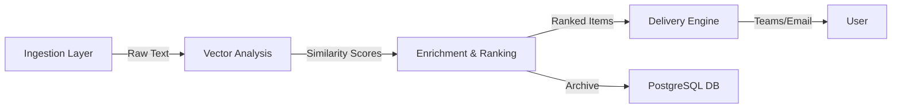

# Passive Policy Intelligence (PPI)

An automated environmental scanning pipeline for the public sector.

## 🏛️ G7 GovAI Grand Challenge Submission

**Problem Statement 1: Information Management**

Policy analysts manually track dozens of sources to stay current on their mandates. This wastes time and risks missing critical updates buried in high-volume feeds.

**Passive Policy Intelligence (PPI)** is a "passive listener" that automates the ingestion, ranking, and archiving of policy intelligence. It replaces manual web trawling with a self-hosted pipeline that:

- **Ingests** articles daily from government, media, and think-tank sources
- **Ranks** content against user-defined "Semantic Anchors" (policy topics)
- **Delivers** via Microsoft Teams (daily digest) and web portal (searchable archive)

## 🔒 Data Sovereignty

This system is designed for **Local-First / Sovereign Compute**:

- **No External AI APIs**: Core pipeline runs entirely on local embedding models (sentence-transformers)
- **No Data Exfiltration**: Content processing happens within your secure environment (on-prem or private cloud)
- **Audit Trail**: Every article, score, and decision is archived in a local PostgreSQL database

## 📸 See It In Action

<table>
<tr>
<td width="50%">
<strong>The Daily Digest (MS Teams)</strong><br/>
<br/>
Delivers ranked intelligence to where you work.
</td>
<td width="50%">
<strong>The Research Archive (Web Portal)</strong><br/>
<br/>
Searchable archive for deep research.
</td>
</tr>
</table>

**Live Demo**: [View the web portal](https://your-demo-url.github.io)

## 🏗️ Architecture

The system is built as a modular pipeline, designed to run on low-cost infrastructure (e.g., Azure B1s VM or local server).



### 1. Ingestion Layer (`src/ingestion`)

- **Dataset Agnostic**: Users configure their own source lists (RSS, JSON, web scraping)
- **Deduplication**: Prevents noise by ensuring only new content is processed

### 2. Analysis Layer (`src/analysis`)

- **Semantic Anchors**: Users define policy topics using **Hypothetical Document Embeddings (HyDE)**
  - Instead of keyword lists or example documents, the system uses hypothetical policy briefs generated from representative documents and tags
  - Improves matching accuracy by including language semantically similar to target content
- **Vector Embeddings**: Uses sentence-transformers (local) to calculate semantic similarity (0-1 scale)
- **Source-Aware Filtering**: Tiered thresholds prevent high-volume sources from drowning out authoritative research
  - Low-volume sources (think tanks): Score > 0.20
  - Medium-volume (government): Score > Historical Mean
  - High-volume (news): Score > Mean + 1 Std Dev

### 3. Delivery Engine (`src/delivery`)

- **Modular Output**: Decoupled from analysis. Currently supports Microsoft Teams (Adaptive Cards), extensible to email or Slack
- **Digest Generation**: Runs on schedule (e.g., 7:00 AM) to deliver a concise "Morning Paper"

## 🚀 Getting Started

### Prerequisites

- Python 3.10+
- PostgreSQL 14+ (or Docker container)
- Optional: Microsoft Teams Webhook URL (for notifications)

### Installation

**Clone the Repository**

```bash
git clone https://github.com/your-org/passive-policy-intelligence.git
cd passive-policy-intelligence
```

**Set Up Environment**

```bash
python -m venv venv
source venv/bin/activate  # or venv\Scripts\activate on Windows
pip install -r requirements.txt
```

**Configure Environment Variables**

Copy `.env.example` to `.env` and configure your database credentials and optional Webhook URLs.

```bash
cp .env.example .env
```

**Initialize Database**

Run the setup script to create the schema and seed initial data.

```bash
python scripts/setup/setup_database.py
```

### Usage (CLI)

The project includes a TUI (Terminal User Interface) for easy management.

```bash
python manage.py
```

- **Manage Sources**: Add/Remove RSS feeds
- **Manage Anchors**: Create new Semantic Anchors for your policy topics
- **Run Pipeline**: Manually trigger ingestion and analysis

## 🔑 Key Features

### Hypothetical Document Embeddings (HyDE)

Instead of matching against keyword lists or example documents, users define policy topics using *hypothetical policy briefs* that exemplify the topic. These are generated (via DSPy framework) from:
- Representative documents (URLs or PDFs)
- Tag combinations (keywords)

**Example**: Instead of searching for "AI governance" or uploading 10 policy papers, you generate a hypothetical brief that discusses AI governance in the style of your target sources.

### Interoperability & Model Abstraction

- **DSPy Framework**: Allows swapping between AI providers (OpenAI, Anthropic, local LLMs)
- **Modular Components**: Ingestion, embedding, and delivery layers are decoupled
- **Deployment Flexibility**: On-premises, private cloud, or hybrid configurations

### Explainable Rankings

- System ranks content (0-1 scale), doesn't generate text or make autonomous decisions
- Every score ties back to a specific semantic anchor
- No hallucinations, no hidden logic
- Lower-ranked items remain accessible for manual review

## 🛠️ Current Status

This repository is a **working prototype (MVP)** submitted for the G7 GovAI Challenge.

**Completed:**
- [x] Core Pipeline (Ingestion → Vector Store → DB)
- [x] Semantic Anchor Management (HyDE methodology)
- [x] Microsoft Teams Integration
- [x] Web Portal (Observable Framework)
- [x] Source-Aware Filtering Logic

**Future Enhancements:**
- [ ] Multi-User Access: RBAC for team-based anchor management
- [ ] Additional Delivery Channels: Email (SMTP), Slack
- [ ] Enhanced Analytics: Trend analysis and topic clustering

## 📜 License

Distributed under the MIT License. See `LICENSE` for more information.

---

**Developed for the G7 GovAI Grand Challenge 2025**
